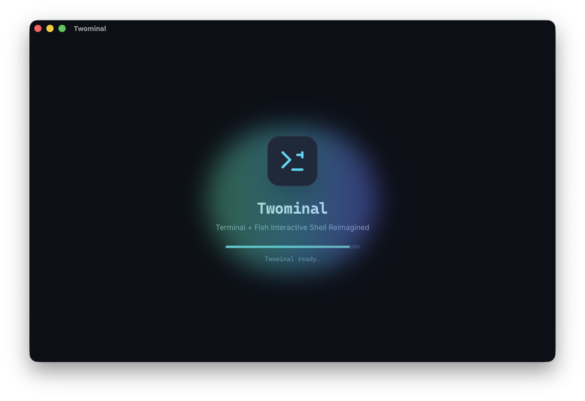
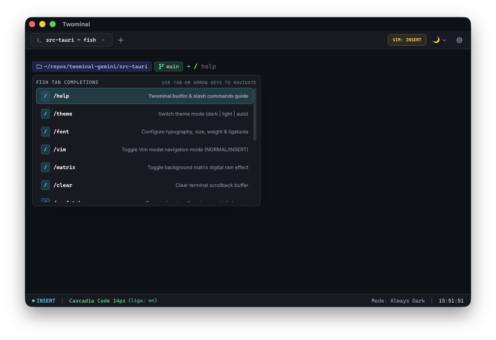

# Twominal 🐚

> A cross-platform, high-performance terminal emulator inspired by the Fish shell experience (autosuggestions, live syntax highlighting, interactive tab completion) with modern UI micro-interactions, ligature typography, multi-tab windowing, and Vim modal editing.

<p align="center">
  
  <br/><br/>
  
</p>

---

## 🚀 Key Features

### 1. ⚡ Fish-Shell Behaviors (Built Right into the Terminal)
- **Real-Time Syntax Highlighting:** Valid system commands, aliases, and builtins are highlighted in accent green, while invalid commands are highlighted in warning red with real-time `$PATH` lookup.
- **Inline Ghost Autosuggestions:** History-aware inline suggestions appear as you type. Accept with <kbd>→</kbd>, <kbd>Ctrl+F</kbd>, or accept next word with <kbd>Alt+→</kbd>.
- **Interactive Tab Completion:** Press <kbd>Tab</kbd> to reveal a rich floating completion menu with file/folder/builtin/executable badges and keyboard navigation.
- **Persistent Command History:** Automatically tracks and indexes command history across sessions.

### 2. 🪟 Multi-Tab Windowing & Session Isolation
- **Independent PTY Sessions:** Each tab runs an isolated shell process using native cross-platform PTYs (`portable-pty` on macOS/Linux and ConPTY on Windows).
- **Hotkeys:**
  - `Cmd/Ctrl + T`: New Tab
  - `Cmd/Ctrl + W`: Close Tab
  - `Cmd/Ctrl + 1..9`: Direct Tab Switching
  - `Ctrl + Tab` / `Ctrl + Shift + Tab`: Cycle Tabs Forward / Backward

### 3. 🎨 Theming & Solar Scheduling
- **Curated Themes:** Catppuccin Mocha, Catppuccin Latte, Tokyo Night, Dracula, Nord, One Light.
- **Dynamic Scheduling Modes:**
  - `Always Dark`
  - `Always Light`
  - `Solar (Sunrise to Sunset)`: Automatically transitions between light and dark themes based on local solar time.
  - `System`: Follows the host OS dark/light mode preference.

### 4. 🔤 Developer Typography & Font Ligatures
- Support for ligature-enabled developer monospace fonts (**Fira Code**, **JetBrains Mono**, **Cascadia Code**, **Menlo**).
- Configurable font size, line-height, letter-spacing, cursor styles (block, underline, bar), and smooth cursor blinking.

### 5. ⌨️ Vim Modal Mode
- Integrated Vim mode engine for the prompt and command buffer.
- Toggle anytime via <kbd>Ctrl + Shift + V</kbd> or via the Status Bar.
- Supports **NORMAL**, **INSERT**, and **VISUAL** states with classic motions (`h/j/k/l`, `w/b/e`, `0/$`, `dd`, `dw`, `ciw`, `x`, `p`, `u`).

### 6. ✨ Fluid Animations & Splash Screen
- Polished startup splash screen with glowing logo reveal and fade-out transition into the active terminal shell.

---

## 📦 Installation

### macOS (One-Line Automated Install)
Run the following in your terminal to install the latest release directly to `/Applications` (automatically configures Gatekeeper permissions):

```bash
curl -fsSL https://raw.githubusercontent.com/two-net/twominal/main/install.sh | bash
```

### Manual Download
Download the latest `.dmg`, `.deb`, `.AppImage`, or `.exe` from [Releases](https://github.com/two-net/twominal/releases/latest).

> **Note for macOS Manual Downloads:** If macOS displays *"Twominal is damaged and can't be opened"*, simply run:
> ```bash
> xattr -cr /Applications/Twominal.app
> ```

---

## 🛠️ Architecture & Project Structure

```
twominal-gemini/
├── assets/                      # Application media and screenshots
├── index.html                   # Application HTML shell
├── vite.config.ts               # Vite bundler config
├── tsconfig.json                # TypeScript compiler configuration
├── package.json                 # Frontend dependencies & scripts
├── src/
│   ├── main.ts                  # Application bootstrap entry point
│   ├── vite-env.d.ts            # Client environment types
│   ├── fish/
│   │   ├── SyntaxHighlighter.ts # Real-time shell syntax tokenization & validation
│   │   ├── Autosuggestions.ts   # Inline ghost text suggestions
│   │   ├── CompletionMenu.ts    # Interactive tab completion popup menu
│   │   └── HistoryManager.ts    # Persistent history manager & search
│   ├── fonts/
│   │   └── FontManager.ts       # Font settings, sizing, and ligatures
│   ├── splash/
│   │   └── SplashScreen.ts      # Startup splash screen & animations
│   ├── styles/
│   │   └── main.css             # Theme variables, glassmorphism, UI components
│   ├── tabs/
│   │   └── TabManager.ts        # Multi-tab lifecycle & session coordinator
│   ├── terminal/
│   │   └── TerminalSession.ts   # xterm.js instance & PTY stream bridge
│   ├── theme/
│   │   ├── themes.ts            # Dark & light color palettes
│   │   └── ThemeManager.ts      # Theme manager & solar scheduler
│   ├── ui/
│   │   ├── SettingsModal.ts     # Settings dialog (fonts, themes, cursor, vim)
│   │   ├── Shortcuts.ts         # Global desktop keybindings
│   │   └── StatusBar.ts         # Bottom status bar with live indicators
│   └── vim/
│       └── VimModeEngine.ts     # Vim modal state machine & motions
└── src-tauri/
    ├── Cargo.toml               # Rust dependencies (portable-pty, tokio, which, dirs, chrono)
    ├── tauri.conf.json          # Tauri v2 configuration & window settings
    └── src/
        ├── lib.rs               # Tauri application builder & command registration
        ├── main.rs              # Desktop executable entry point
        ├── commands.rs          # Tauri IPC command handlers
        ├── fish/
        │   └── mod.rs           # Shell builtin checks, PATH lookup, history persistence
        ├── pty/
        │   └── mod.rs           # Native PTY spawner, streaming readers, resizer
        └── theme/
            └── mod.rs           # Solar daylight calculation
```

---

## 🏃 Getting Started

### Prerequisites
- [Rust](https://www.rust-lang.org/) (Cargo 1.80+)
- [Node.js](https://nodejs.org/) & [pnpm](https://pnpm.io/)
- Tauri v2 CLI (`cargo install tauri-cli --version "^2.0"`)

### Install Dependencies
```bash
pnpm install
```

### Run in Development
```bash
cargo tauri dev
```

### Build for Production
```bash
cargo tauri build
```

---

## 📄 License

This project is licensed under the [MIT License](LICENSE).

